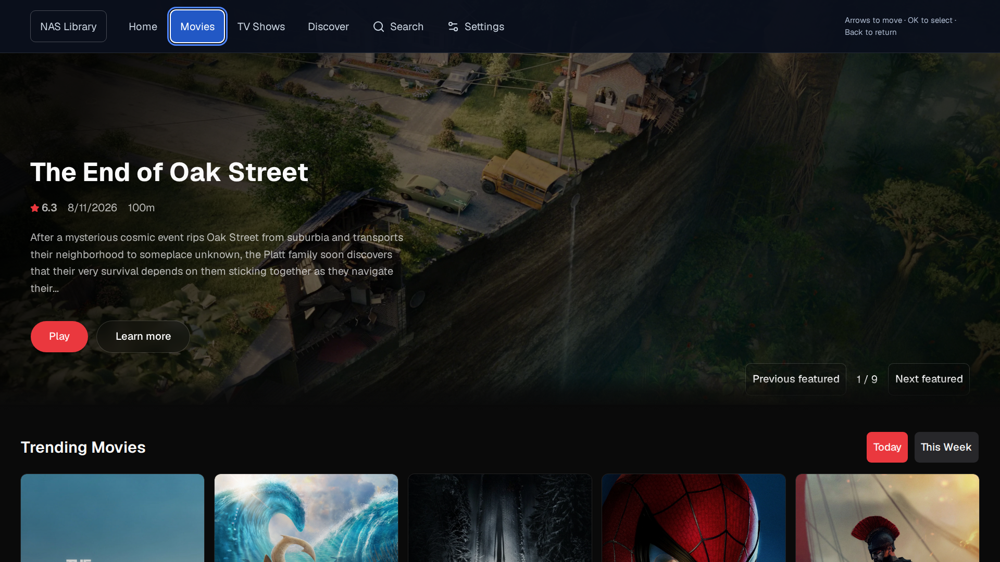
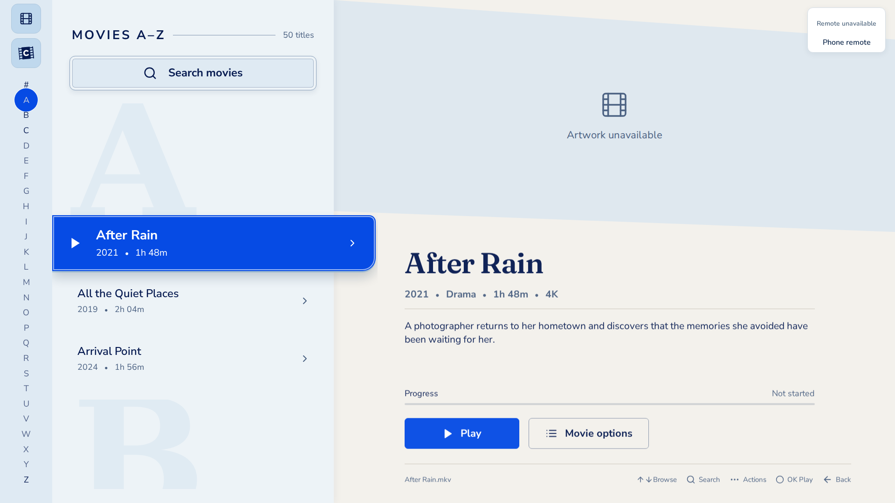
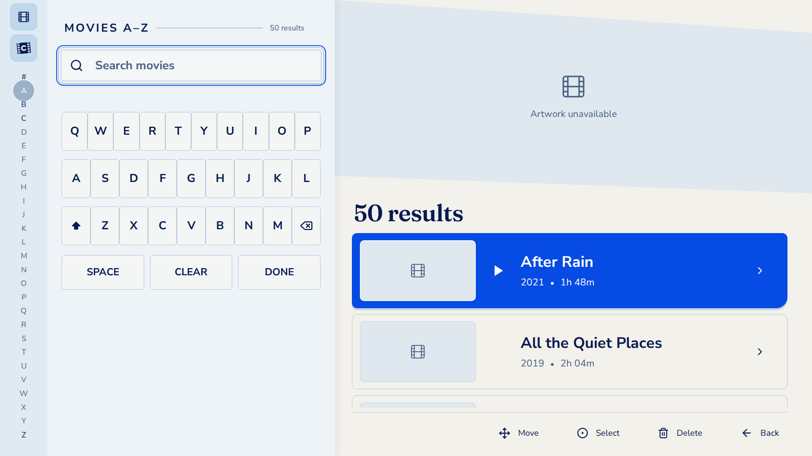
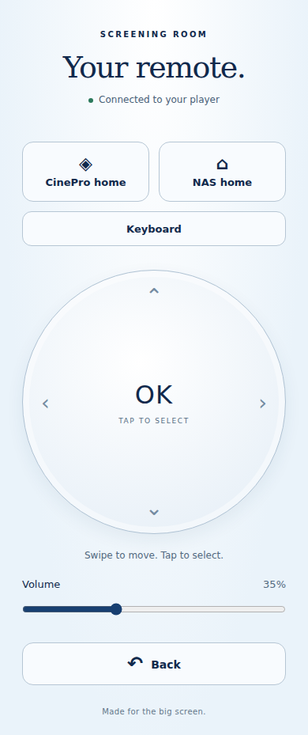

# Screening Room

**Your movie library, online browsing, and a phone remote — together on your TV.**

Screening Room is a home media application for Linux and Raspberry Pi. Connect it
to a TV, point it at a folder of movies or a NAS (network-attached storage), and
browse from the couch. Switch to the integrated **CinePro** view to explore
movies, TV shows, and anime through configurable online providers.

Control it with a keyboard, a phone, or an AI assistant through the optional MCP
remote interface.

[Get started](#get-started) · [Screenshots](#a-look-inside) · [Phone remote](#control-it-from-your-phone) · [MCP setup](mcp/README.md)



## What you can do

| Feature | What it does |
| --- | --- |
| **Browse your own movies** | Scan a local folder or mounted NAS share, jump through an A–Z library, and search by title. |
| **Pick up where you left off** | Play files with the native mpv player and save watch progress locally. |
| **Explore CinePro** | Browse movies, shows, and anime; choose episodes and switch online providers. |
| **Use TV-friendly controls** | Navigate with arrows and OK, use an on-screen keyboard, and select available audio or subtitle tracks. |
| **Turn your phone into a remote** | Scan the app's QR code for a browser remote with a swipe pad, keyboard, and volume controls. |
| **Connect an AI assistant** | Use MCP tools to switch views, enter a title search, send buttons, and read basic app status. |

Your movie files stay in their original folder. The app stores its library index
and watch progress on the player device. Optional TMDB configuration adds movie
information and artwork.

## A look inside

### Your library, organized for the big screen

An alphabetical list keeps navigation simple, with movie details and saved
progress beside the selected title.



### Search without reaching for a laptop

Use the on-screen keyboard, type on a physical keyboard, or enter text from your
phone.



*The library and search screenshots use sample titles with fallback artwork.
The CinePro screenshot shows the integrated online interface; its catalog and
provider availability can change.*

## Get started

This repository contains the source code. Build it on the device that will run
the player. The main application uses **Qt 6, React/TypeScript, and libmpv**.

### Raspberry Pi

Use **64-bit Raspberry Pi OS with Desktop**. From a terminal:

```sh
git clone https://github.com/cpan1995/home_nas_stream.git
cd home_nas_stream
bash install-pi.sh
```

Run the installer as your normal desktop user. It requests administrator access
when needed, installs dependencies, builds the app, and enables desktop auto-login
and fullscreen startup. It does not reboot automatically.

After installation:

1. **Connect your movies.** Mount a NAS share with `python3 scripts/connect-nas.py`,
   or point the app at a local folder.
2. **Configure online access.** Follow [Provider settings and API keys](#provider-settings-and-api-keys).
3. **Launch the app.** Run `bash scripts/start-pi.sh`, or restart the Pi to use automatic startup.

See the [Raspberry Pi guide](docs/raspberry-pi.md) for prerequisites, NAS mounting,
manual installation, and disabling automatic startup.

### Linux desktop / WSLg

You need **Node.js 22.19 or newer**, npm, a C++ build toolchain, Qt 6 WebEngine,
libmpv, and FFmpeg. Install the native packages listed in the
[manual build guide](docs/raspberry-pi.md#manual-build-on-the-pi), then:

```sh
git clone https://github.com/cpan1995/home_nas_stream.git
cd home_nas_stream
npm ci
npm run configure:streams -- --init
npm run setup:cinepro
npm run build:native
SCREENING_ROOM_LIBRARY_DIR=/path/to/movies npm start
```

Replace `/path/to/movies` with your movie folder or mounted NAS directory. Edit
the private configuration below before using online browsing.

On Windows, the application runs through Linux in WSLg. The included `.cmd`
launchers are development helpers and may need their checkout paths adjusted;
they are not standalone Windows installers.

## Provider settings and API keys

Streaming provider URLs and API credentials live in one private file:

```text
.local/stream-providers.env
```

Initialize it once from the project root:

```sh
node scripts/configure-streams.mjs --init
```

Set `TMDB_READ_ACCESS_TOKEN` for catalog and NAS metadata access, and
`TMDB_API_KEY` for Core providers that require it. Initialization generates the
local service tokens. On a Pi installation, use `.local/node/bin/node` if Node
is not available on your shell's PATH.

The private file is Git-ignored. The shareable defaults are in
[`config/stream-providers.env.example`](config/stream-providers.env.example).
Credentials stay on the backend. After editing provider URLs, regenerate settings
and rebuild; after changing credentials, restart the services.

See the [configuration guide](docs/stream-configuration.md) for the full workflow.
Local file playback can be used without TMDB credentials.

## Control it from your phone

Keep your phone and player on the same home network. Open **Phone remote** in the
NAS Library and scan its QR code. The remote runs in your phone's browser.

<p align="center">
  
</p>

Roku-compatible phone remote apps can also discover the player. The receiver
accepts controls from the local network without a pairing PIN, so keep it on a
trusted home network. See [remote setup and controls](REMOTE.md).

### Keyboard basics

| Key | Action |
| --- | --- |
| Arrow keys | Move through titles and controls |
| Enter / OK | Select the focused item |
| Escape / Backspace | Go back or close the current menu |
| Space during local playback | Play / pause |
| Ctrl+1 / Ctrl+2 | Switch to NAS Library / CinePro |

## Control it through MCP

The optional **Model Context Protocol (MCP)** server lets an assistant act as a
remote for the running native app. Example requests include:

- “Open CinePro.”
- “Search for Interstellar.”
- “Turn the volume down.”

It exposes button presses, text entry, app switching, prepared search sequences,
and basic status. Search tools enter the query and navigate the interface; they
do not read or verify the results on screen.

Install the separate MCP dependencies with `npm ci --prefix mcp`, then follow the
[MCP connection guide](mcp/README.md). The MCP server itself requires no OpenAI API key.

## Current status

Screening Room is an actively developed home-media project. Local library
playback, CinePro browsing, phone controls, and the MCP layer are implemented.

- **NAS setup is manual:** there is no in-app first-run connection wizard yet.
- **Online playback depends on providers:** availability, title matching, quality,
  and track controls vary by source.
- **Hardware matters:** 1080p H.264 playback has been checked on a Pi 5. That does
  not establish support for every codec, 4K, HDR, or audio output.
- **Browser preview is limited:** `npm run dev` previews the library interface;
  local movie playback requires the native application.

## Documentation and development

| Guide | Contents |
| --- | --- |
| [Raspberry Pi setup](docs/raspberry-pi.md) | Installation, startup, NAS mounting, and device notes |
| [Streaming configuration](docs/stream-configuration.md) | Provider URLs, API keys, and rebuild steps |
| [CinePro integration](CINEPRO.md) | Online browsing, player controls, and provider limitations |
| [Phone remote](REMOTE.md) | Browser remote, discovery, networking, and supported buttons |
| [MCP server](mcp/README.md) | Client configuration, tools, and search workflows |
| [Repository map](docs/repository-map.md) | Where the application components live |
| [Source packaging](docs/source-packaging.md) | Bundled CinePro sources and fresh-clone restoration |
| [Development notes](docs/development.md) | Detailed architecture, controls, tests, and historical diagnostics |

Basic development checks:

```sh
npm run build
npm test
npm run test:stream-config
```

Native and CinePro integration checks have additional setup; see the development
notes and integration guides above.

## Credits and bundled licenses

Screening Room builds on Qt, React, mpv, TMDB metadata, and customized CinePro
sources. Bundled CinePro [Core](vendor/cinepro/LICENSE) and
[UI](vendor/cinepro-ui/LICENSE.md) carry the **PolyForm Noncommercial 1.0.0**
license. Miruro-derived code has an included [MIT notice](docs/licenses/miruro-api.txt).
See the individual components for their license terms.
